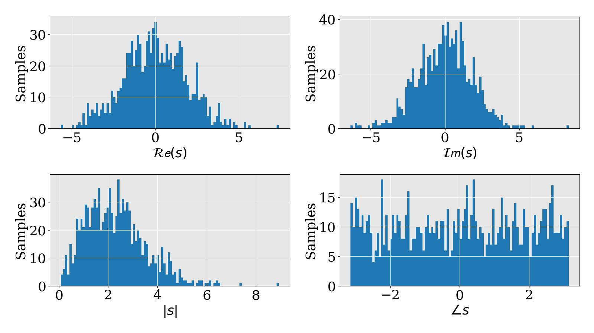
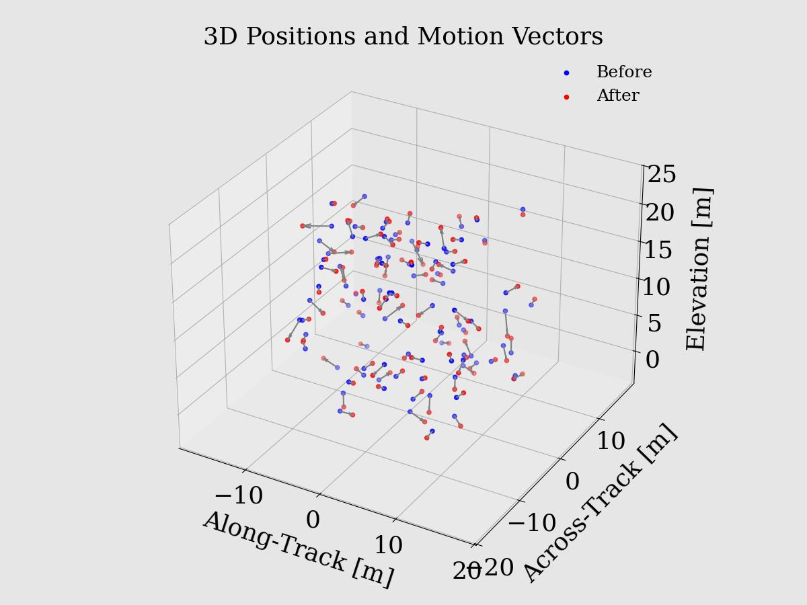
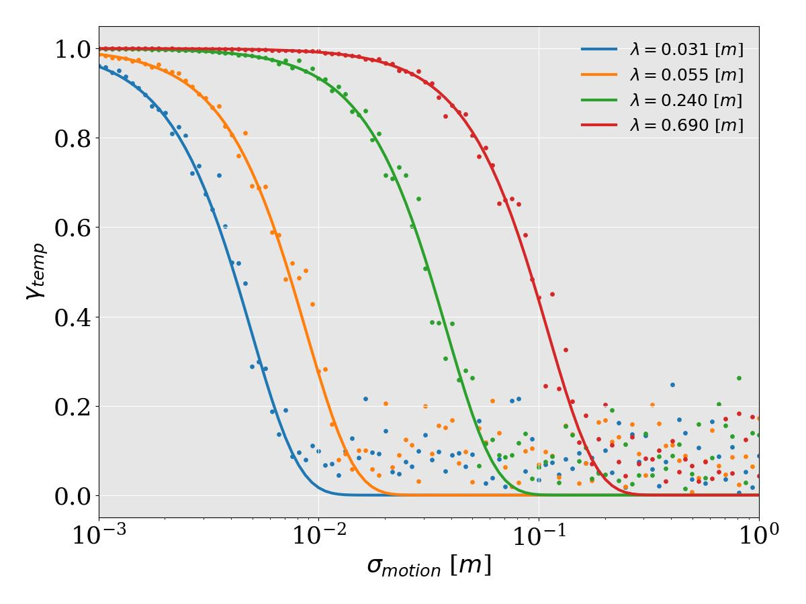

# INSAR-DECORRELATION-SIMULATOR
A bare-bones educational simulator for understanding different decorrelation effects. 
At the core lies the simulation of SAR cells as a collection of elementary scatterers, each with its own position and complex dielectric constant.
Computes the complex reflection coefficient using the Fresnel equations. 

## Temporal Decorrelation
Simulates temporal change as a Gaussian-distributed random shift in position.
The simulated coherence values are compared against the temporal decorrelation model of `Zebker and Villasenor (1992)`.

# MISSING/TODO
- support for antenna pattern
- support for angle-depentent RCS
- support for proper power transfer 
- support for more decorrelation effects: baseline, snr, volume, quantization,..

